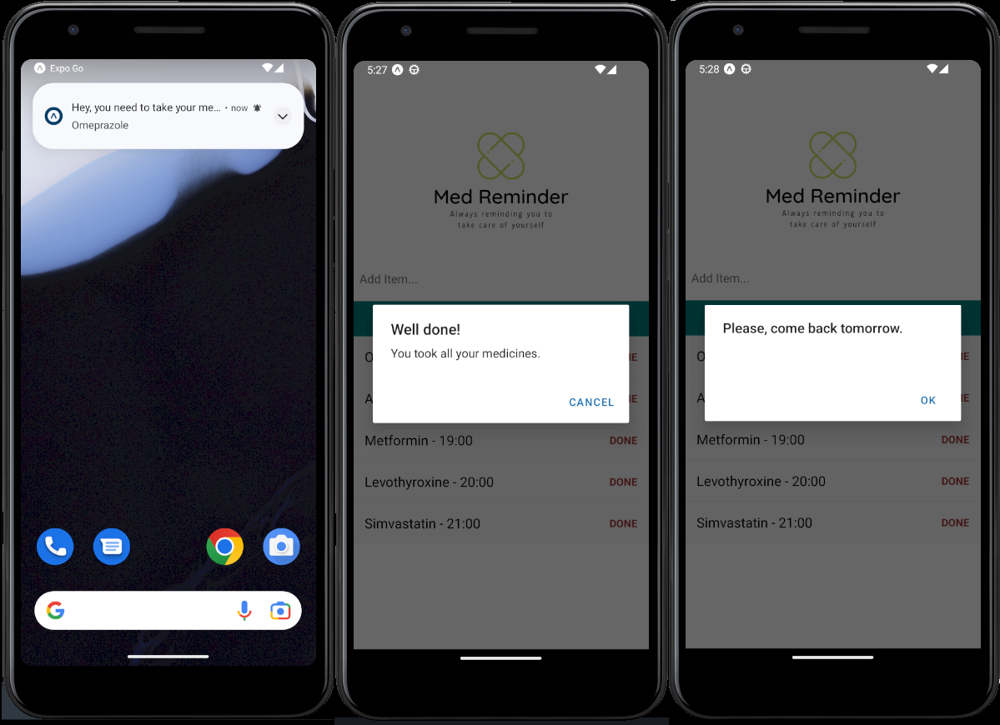

# Med Reminder

This is an app made with React Native and Expo that reminds the person to take their medicine. The app starts with a fixed list of medicines and whenever the user clears the list, the app sends an alert telling him to come back the next day. The app also sends a notification whenever you need to take a specific medicine.



## Features

- add medicines
- remove medicines
- sends notifications

## Tech

- React Native
- Expo

## Installation

Clone the repository:

```bash
git clone https://github.com/wdpedroborges/med-reminder
```

For production:

```sh
cd med-reminder
npm install
expo start
```

## License

This project is licensed under the MIT License. Please see the LICENSE file for more details.
